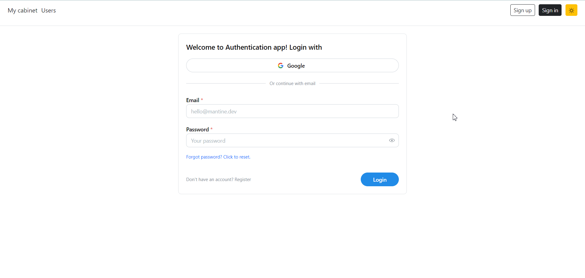

# 🌟 Authentication App 🌟

Welcome to the Authentication App! This application combines the power of Node.js, PostgreSQL, and React to provide a robust and aesthetically pleasing authentication system.

## 👋 Introduction

The Beautiful Authentication App is a full-stack web application designed to offer a seamless and secure authentication experience. Whether you're building a personal project or a business application, our app provides the foundation for user authentication while offering a delightful user interface.

## Deployment

Hosted on GitHub: [DEMO LINK](https://bojkovladislav.github.io/authentication-app/#/)

## ✨ Features

- 📝 User Registration: Allow users to create accounts with ease.
- 🔐 User Login: Securely authenticate users.
- 🚀 Forgotten Password: Provide a password reset mechanism.
- 👤 User Profile: Allow users to update their profiles.
- 🎨 Beautiful UI: Create an intuitive and visually appealing user interface.
- 🌓 Theme switcher: Ability to switch theme to the light & dark mode.

## Backend

Link to my backend repo of this application [BACKEND](https://github.com/bojkovladislav/authentication-app-backend)
